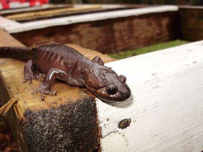

# Note préalable

Vous n'avez pas besoin de modèles de langage comme chatGPT pour faire ce TP.
Toutes les instructions sont disponibles sur cette page, avec ces commandes de
base qu'on doit toujours utiliser quand on inspecte des objets nouveaux :

- affichez les objets dans la console pour avoir des informations essentielles
- inspecter les objets avec `head()` et `tail()` (affiche les 6 premières et 
dernières lignes)
- utilisation de `summary`
- utilisation de `str()` pour voir la structure des objets. Si la structure 
est trop complexe, utiliser `str(x, max.level = <2 ou 3>)`
- utilisation de la commande `plot()`. **Attention, vous allez manipuler des
objets spatiaux lourds : ne lancez pas `plot()` sur les objets en entier pour ne
pas faire planter R. Lancez `plot()` sur quelques lignes seulement : 
`plot(objet[1:10, ])`**

# Etape 1. Téléchargement de données spatiales

## 1.1 Données vectorielles : polygones de distributions d’espèces IUCN

Allez sur le site de l’IUCN : [https://www.iucnredlist.org](https://www.iucnredlist.org), et créez-vous un compte dans la page **Login/Register >>> REGISTER FOR AN ACCOUNT** (en bas). Connectez-vous ensuite avec ce compte sur le site.

Visitez ensuite la page **[Resources and Publications](https://www.iucnredlist.org/resources/grid)**, qui permet de télécharger l’ensemble des données et publications de l’IUCN. Pour le moment, se rendre sur la page **[Spatial Data Download](https://www.iucnredlist.org/resources/spatial-data-download)**. 


Sur cette page, vous pouvez télécharger de nombreuses données de distribution d’espèces au format polygone, ainsi que des données d’occurrence par bassin versant pour les espèces dulçaquicoles. Vous pouvez soit télécharger l’ensemble des données pour un groupe particulier (par exemple, les Mammifères), soit télécharger les données pour un groupe spécifique (par exemple, les mammifères marins).


*Recherchez et téléchargez les polygones de distribution des amphibiens urodèles.* Lorsque vous demandez à télécharger, il faut préciser le motif de votre téléchargement, vous pouvez indiquer par exemple « teaching ». Une fois le motif entré, vous arrivez dans votre page de téléchargement avec les liens qui permettent d’accéder aux fichiers. Une fois que le fichier .zip contenant les polygones de distribution est sur votre ordinateur, extrayez son contenu dans votre répertoire de données pour R. 

Retournez ensuite sur la page **[Resources and Publications](https://www.iucnredlist.org/resources/grid)**, allez dans la section *Spatial Data & Mapping Resources*, et téléchargez le fichier **Legend combinations for IUCN Red List Spatial Data** (ouvrez la page et cherchez le lien). Ce fichier contient les codes des différents polygones de distribution : présence (espèce présente, éteinte, etc.), origine (zone native, introduite, etc.) et saisonnalité (résidente, saison de reproduction, etc.). Vous aurez besoin de vous y faire référence pour comprendre les données spatiales de l'IUCN.

## 1.2 Données vectorielles : limites des continents

Allez sur le site de **Natural Earth** : [www.naturalearthdata.com](https://www.naturalearthdata.com), dans la section **[Downloads](https://www.naturalearthdata.com/downloads/)**. Intéressez-vous aux données à échelles intermédiaire (1:50m), et allez dans la page sur les données physiques (Physical). Téléchargez les lignes de côtes. Une fois que le fichier .zip contenant les lignes de côtes est sur votre ordinateur, extrayez son contenu dans votre répertoire de données pour R.


## 1.3 Données raster : climatos globales WorldClim

Allez sur le site WorldClim : [www.worldclim.org.](https://www.worldclim.org)
Sur ce site, vous pouvez  télécharger la version 2.1 du jeu de données 
WorldClim. Ce jeu de données correspond à des données de moyennes mensuelles 
interpolées sur la base de milliers de stations météorologiques distribuées dans
le monde entier. Certaines zones étant moins bien couvertes que d’autres en 
termes de stations météo, leur qualité est moins importante, ce qui est à 
prendre en compte quand vous analysez ces données. Dans la version 2.1 de 
WorldClim, des données satellites ont été utilisées pour corriger 
les interpolations, notamment dans les zones à faible densité de stations
météorologiques. 


 
**Téléchargez les données climatiques historiques. Prenez la température 
moyenne à la résolution la plus grossière (10 minutes).** Une fois que le
fichier .zip contenant les climatos de températures moyennes mensuelles est 
sur votre ordinateur, extrayez son contenu dans votre répertoire de données 
pour R. **Attention** : il est important que ces fichiers soient dans un 
sous-dossier (par exemple un dossier 
nommé « worldclim data ») contenant uniquement les rasters et rien d'autre, 
pas même le fichier zip.


# Etape 2 : Lecture des données sous R
## 2.1 Données vectorielles : polygones de distribution d’espèces

### 2.1.1 Avec le package terra

Dans R, chargez le package terra, puis lisez le fichier polygones de distributions IUCN avec la commande `vect()`. Inspectez votre objet spatial.


Questions :

-	Quel est le système de coordonnées ?

-	Combien y a-t-il de polygones ? (Les polygones sont appelés 'geometries')

- Combien y a-t-il de colonnes dans la table qui décrit les polygones (appelée table attributaire)

-	Combien y a-t-il d’espèces ?

- Pourquoi le nombre d'espèces n'est pas égal au nombre de polygones ?

-	Quelle est la famille la plus diversifiée d’urodèles ?

-	Où se trouvent les amphibiens urodèles ? **(N'affichez que les 100 premières 
lignes pour ne pas faire planter votre R - ce sera suffisant pour répondre à
la quesiton)** 

Note :
-	Utilisez `count()` du package R `plyr` pour compter le nombre de répétitions
de chaque élément dans une colonne (familles, espèces...)

- Compter le nombre de polygones est suffisant pour voir quelle est la famille 
la plus diversifiée d'urodèles, même si certaines espèces ont plusieurs 
polygones

### 2.1.2 Avec le package sf

Chargez le package sf, puis lisez le fichier polygones de distribution IUCN avec la commande `st_read()`. Inspectez votre objet sf.

Questions :

-	Où sont réparties les AMBYSTOMATIDAE ?
Quand on utilise la fonction plot avec le package sf,
il faut faire attention à n'afficher qu'une colonne dans le tableau, sinon il
fait plein de figures en même temps pour rien. Par exemple, ici, n'affichez que
la colonne « family ».

Vous pouvez utiliser la fonction `which()` pour n'afficher qu'une famille : 

```
plot(iucn_sf[which(iucn_sf$family == "HYNOBIIDAE"), 
             "family"])
```



*Un petit Ambystoma gracile*

### 2.2 Données vectorielles : limites des continents

Chargez les limites des continents avec le package sf et faites une carte avec la distribution des salamandridae et les limites des continents. 
Pour cela, procédez en deux étapes :

1. Représentez (fonction `plot()`, rappel avec sf : n'affichez qu'une colonne)
les limites Ajoutez les axes (argument
`axes`), ainsi qu’un graticule (argument `graticule`). Ajouter l’argument 
`reset = FALSE` lorsque vous lancez plot sur les limites des continents, 
ce qui permettra d'ajouter les salamandridae par-dessus en suite. 

2. Représentez les ambystomatidae en ajoutant l'argument `add = TRUE`.

Une fois que vous avez effectué cette première représentation graphique avec 
les fonctions de base de R, vous allez faire cette fois-ci une carte en 
illustrant en couleur les différentes familles, mais cette fois-ci avec ggplot2,
en vous inspirant du code ci-dessous :

**Attention, si votre ordinateur n'est pas très puissant, la commande 
ci-dessous peut prendre du temps à s'exécuter. 
C'est la difficulté avec le SIG, ce sont souvent des fichiers très lourds à
afficher. Deux options s'offrent à vous dans ce cas : (1) découper le jeu de 
données en petite parties ; (2) écrire les images sur le disque plutôt que de
les afficher dans la fenêtre de plot**

Si votre ordinateur galère, choisissez une famille plus petite encore : PROTEIDAE 

```
library(ggplot2)
ambysto <- iucn_sf[iucn_sf$family == "AMBYSTOMATIDAE", ]
ggplot() +
  geom_sf(data = continents) +
  geom_sf(data = ambysto, aes(fill = sci_name),
          alpha = .2) +
  guides(fill="none")
```

Comme vous pouvez le noter, les objets de type "sf" sont pris en charge
nativement par ggplot2 avec `geom_sf()`, ce qui est très utile quand on fait 
de la cartographie sur R, surtout avec des données quantitatives.

Si vous voulez une carte interactive, pour zoomer, dézoomer, passer la souris
sur les polygones, vous pouvez utiliser plotly :

```
library(plotly)
p <- ggplot() +
  geom_sf(data = continents) +
  geom_sf(data = ambysto, aes(fill = sci_name),
          alpha = .2) +
  guides(fill="none")
ggplotly(p)
```


### 2.3 Données raster : climatologies WorldClim
Chargez le raster de température moyenne du mois de janvier avec la commande `rast()`.

Questions : 

-	Quelle est la résolution du raster ?

- Quel est le système de coordonnées ?

-	Quelle sont les températures moyennes de janvier les plus élevées et les plus
froides sur la Terre, et où sont-elles situées ?

Pour répondre à ces questions, inspectez votre raster en tapant son nom dans 
la console. Affichez-le avec `plot()`.

Chargez maintenant l’ensembles des rasters de températures moyennes mensuelles
avec la commande `rast()` : pour cela il faut donner à R à la fois le dossier 
dans lequel se trouvent les fichiers, et les noms de fichiers. 
Utilisez `list.files()` qui liste les fichiers d'un répertoire :

```
worldclim <- stack(paste0("data/WorldClim data/", 
                          list.files("data/WorldClim data/")))
```


Question : 

-	Calculez et affichez le raster de moyenne annuelle des températures.


# Etape 3 : analyse biogéographique de la diversité d’urodèles

Nous allons analyser aux échelles biogéographiques la diversité d’urodèles, et la comparer aux valeurs de températures, ce qui va nous amener à réaliser plusieurs opérations sur les polygones et rasters. Ce sont des opérations courantes en biogéographie, qui vont vous faire découvrir quelques outils de SIG. 

La première étape consistera à calculer la richesse spécifique **native non éteinte** d’urodèles. Pour cela, nous devons compter dans chaque cellule d'un raster le nombre d'espèces qui chevauchent cette cellule. Il nous faudra procéder en 3 étapes :

1. Filtrer les polygones de distribution pour éliminer les zones où les espèces sont éteintes et les zones non natives

2. Préparer un raster qui servira de base pour calculer la richesse spécifique. Nous allons travailler à une résolution plus grossière que notre raster de température, pour réduire le temps de calcul.

3. Pour ce raster, nous allons calculer dans chaque cellule le nombre de polygones d'espèces qui chevauchent la cellule - et ainsi obtenir la richesse spécifique dans chaque cellule. 

## 3.1 Distributions d’urodèles natives et non éteintes

Référez-vous aux métadonnées de l’IUCN : quels codes utiliser ?

Voici un exemple de ligne qui permet de ne garder que les données de présence actuelle (non éteinte) :

```
iucn_sf <- iucn_sf[which(iucn_sf$presence == 1), ]
```

Complétez ce code pour faire la même chose pour les **zones natives**.

## 3.2 Travail sur une résolution plus grossière pour réduire le temps de calcul 


Nous allons créer un raster aux mêmes caractéristiques que notre climatologie WorldClim. Cependant, la résolution de WorldClim est trop fine et les calculs seront trop longs, donc nous allons tout d’abord grossir la résolution de la température moyenne annuelle de WorldClim.

Pour cela, utilisez la fonction `aggregate` sur le raster de température moyenne annuelle, avec un facteur d’aggrégation de 6 (on agrège les cellules 6 par 6).

## 3.3 Calcul de la richesse spécifique


Intuitivement, il parait logique de compter le nombre de polygones de distribution d'espèces qui chevauchent une cellule pour savoir combien il y a d'espèces. Cependant, une même espèce peut avoir plusieurs polygones différents ; ainsi, si on compte simplement le nombre de polygones, on peut obtenir une valeur qui ne correspond pas à la réalité. Ainsi, on ne peut pas se contenter de compter le nombre de polygones ; il nous faudra analyser la colonne "sci_name" pour compter le nombre d'espèces. 

Comment faire cela ? Depuis le package terra, c'est un petit peu plus compliqué qu'avant ; il va falloir coder un petit peu.

Nous allons d'abord regrouper les polygones par espèce afin de n'avoir qu'un seul groupe de polygones par espèce. Ensuite, il suffira de compter le nombre de groupe de polygones dans chaque cellule pour avoir la richesse.


```
# 0. Etape préalable souvent nécessaire 
# S'assurer que les polygones sont valides. Souvent, ils ne le sont
# pas, ce qui cause des erreurs de calcul ; pour éviter les problèmes,
# on utilise st_make_valid() :
iucn_sf <- st_make_valid(iucn_sf)

# 1. Regrouper les polygones par espèce. Cette opération est longue
# Soyez patients ! Cela prend plusieurs minutes. 
# Si c'est trop long vous pouvez faire le calcul sur une famille seulement

# Utilisons la syntaxe du package dplyr pour écrire ce code:
library(dplyr)
iucn_poly_par_sp <- iucn_sf %>% 
  group_by(sci_name) %>%
  summarise(geometry = st_union(geometry))
# Lisons ce code : 
# Partir du tableau iucn_sf
# Le grouper par rapport à la colonne sci_name (= grouper par espèce)
# Réaliser l'union des polygones (st_union(geometry)) et obtenir comme
# résultat un tableau avec une seule ligne par espèce (summarise())
# Le temps de calcul est long car l'opération géométrique d'union sur des 
# polygones complexes est longue : soyez patients

# 2. Ajouter une colonne numérique avec la valeur '1' pour chaque
# espèce. Cette astuce nous permettra de calculer la somme dans chaque 
# cellule ensuite
iucn_poly_par_sp$occurrence <- 1


# 3. Calculer la richesse
# On utilise la commande 'rasterize' qui transforme les polygones 
# en rasters. Pour chaque cellule, on va demander à la fonction 
# de calculer la somme de la colonne 'occurrence', ce qui reviendra
# à compter le nombre d'espèces qui ont un polygone chevauchant la 
# cellule.
# On utilise notre raster de température comme modèle de base ici (MAT)
richness <- rasterize(iucn_poly_par_sp, 
                      MAT,
                      field = "occurrence",
                      fun = sum)
```


Vous pouvez ensuite analyser graphiquement la richesse en fonction de la température, en récupérant les valeurs de richesse et de température avec `values`, puis en affichant la richesse en fonction de la température.

Questions :

-	Où est la richesse la plus élevée ?

-	Que pouvez-vous déduire sur les limites de température des urodèles ? 

-	Que remarquez-vous de particulier sur le graphe température/richesse ?
 
# Etape 4 : faire une belle carte

Voici un exemple de code pour faire une belle carte interactive :

```
# On transforme le raster en data.frame pour ggplot2
richness_df <- as.data.frame(richness, xy = TRUE, na.rm = TRUE)

p <- ggplot() +
  geom_tile(data = richness_df, aes(x = x, y = y, fill = occurrence)) +  
  geom_sf(data = continents, color = "black", fill = NA) +        
  scale_fill_viridis_c(option = "magma", na.value = "transparent") +  
  theme_minimal() + xlab("") + ylab("")

ggplotly(p)
```


Et voilà !

# Pour aller plus loin…

Deux livres complets sur la cartographie avec R sont disponibles gratuitement en ligne :

https://r.geocompx.org/

https://rspatial.org/

