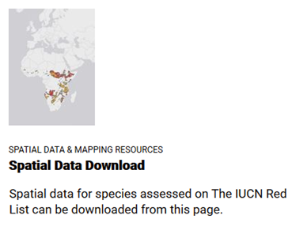
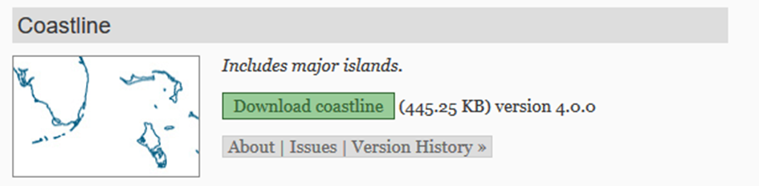
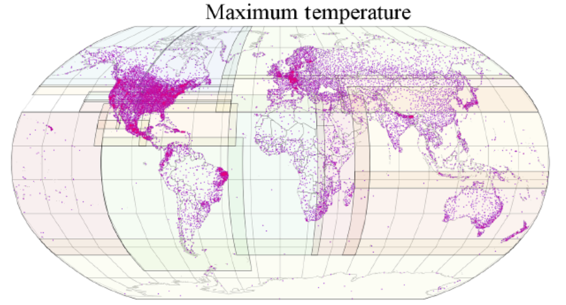

# Etape 1. Téléchargement de données spatiales

## 1.1 Données vectorielles : polygones de distributions d’espèces IUCN

Allez sur le site de l’IUCN : [www.iucnredlist.org](www.iucnredlist.org), et créez-vous un compte dans la page **Login/Register >>> REGISTER FOR AN ACCOUNT** (en bas). Connectez-vous ensuite avec ce compte sur le site.

Visitez ensuite la page **[Resources and Publications](https://www.iucnredlist.org/resources/grid)**, qui permet de télécharger l’ensemble des données et publications de l’IUCN. Pour le moment, se rendre sur la page **[Spatial Data Download](https://www.iucnredlist.org/resources/spatial-data-download)**. 



Sur cette page, vous pouvez télécharger de nombreuses données de distribution d’espèces au format polygone, ainsi que des données d’occurrence par bassin versant pour les espèces dulçaquicoles. Vous pouvez soit télécharger l’ensemble des données pour un groupe particulier (par exemple, les Mammifères), soit télécharger les données pour un groupe spécifique (par exemple, les mammifères marins).


*Recherchez et téléchargez les polygones de distribution des amphibiens urodèles.* Lorsque vous demandez à télécharger, il faut préciser le motif de votre téléchargement, vous pouvez indiquer par exemple « teaching ». Une fois le motif entré, vous arrivez dans votre page de téléchargement avec les liens qui permettent d’accéder aux fichiers. Une fois que le fichier .zip contenant les polygones de distribution est sur votre ordinateur, extrayez son contenu dans votre répertoire de données pour R. 

Retournez ensuite sur la page **[Resources and Publications](https://www.iucnredlist.org/resources/grid)**, allez dans la section *Spatial Data & Mapping Resources*, et téléchargez le fichier **Legend combinations for IUCN Red List Spatial Data** (ouvrez la page et cherchez le lien). Ce fichier contient les codes des différents polygones de distribution : présence (espèce présente, éteinte, etc.), origine (zone native, introduite, etc.) et saisonnalité (résidente, saison de reproduction, etc.). Vous aurez besoin de vous y faire référence pour comprendre les données spatiales de l'IUCN.

## 1.2 Données vectorielles : limites des continents

Allez sur le site de **Natural Earth** : [www.naturalearthdata.com](https://www.naturalearthdata.com), dans la section **[Downloads](https://www.naturalearthdata.com/downloads/)**. Intéressez-vous aux données à échelles intermédiaire (1:50m), et allez dans la page sur les données physiques (Physical). Téléchargez les lignes de côtes. Une fois que le fichier .zip contenant les lignes de côtes est sur votre ordinateur, extrayez son contenu dans votre répertoire de données pour R.

[lien direct si le site est temporairement inaccessible](https://naturalearth.s3.amazonaws.com/50m_physical/ne_50m_coastline.zip)



## 1.3 Données raster : climatos globales WorldClim

Allez sur le site WorldClim : [www.worldclim.org.](https://www.worldclim.org) Sur ce site, vous pouvez  télécharger la version 2.0 du jeu de données WorldClim. Ce jeu de données correspond à des données de moyennes mensuelles interpolées sur la base de milliers de stations météorologiques distribuées dans le monde entier. Certaines zones étant moins bien couvertes que d’autres en termes de stations météo, leur qualité est moins importante, ce qui est à prendre en compte quand vous analysez ces données. Dans la version 2.0 de WorldClim, des données satellites ont été utilisées pour corriger les interpolations, notamment dans les zones à faible densité de stations météorologiques. 


 
**Téléchargez les données historiques de température moyenne à la résolution la plus grossière (10 minutes).** Une fois que le fichier .zip contenant les climatos de températures moyennes mensuelles est sur votre ordinateur, extrayez son contenu dans votre répertoire de données pour R. Attention : il est important que ces fichiers soient dans un sous-dossier contenant uniquement les rasters (par exemple un dossier nommé « worldclim data »).


# Etape 2 : Lecture des données sous R
## 2.1 Données vectorielles : polygones de distribution d’espèces

### 2.1.1 Avec le package sp

Dans R, chargez le package rgdal ET le package raster***, puis lisez le fichier polygones de distributions IUCN avec la commande `readOGR()`. Inspectez votre objet spatial.

*** *Le package raster modifie la façon dont les objets sp sont affichés. Si vous ne chargez pas raster et que vous tapez le nom de votre objet spatial dans la console, dites adieu à votre console… (faites le test par vous-mêmes)*

Questions :

-	Quel est le système de coordonnées ?

-	Combien y a-t-il de polygones ?

-	Combien y a-t-il d’espèces ?

-	Quelle est la famille la plus diversifiée d’urodèles ?

-	Où se trouvent les espèces d’amphibiens urodèles ?

Pour cela, inspectez votre objet spatial :

-	Affichez le dans la console

-	Utilisez `summary()`

-	Utilisez la fonction `plot()`

### 2.1.2 Avec le package sf

Chargez le package sf, puis lisez le fichier polygones de distribution IUCN avec la commande `st_read()`. Inspectez votre objet sf.

Questions :

-	Comment sont réparties géographiquement les familles majoritaires d’urodèles ?
Pour cela, utilisez la fonction plot, mais n’affichez que la colonne « family » : par exemple, `plot(iucn_sf["family"])`


Vous pouvez également n’afficher qu’une seule famille en utilisant la fonction `which` : 

```
plot(iucn_sf[which(iucn_sf$family == "HYNOBIIDAE"), 
             "family"])
```

### 2.2 Données vectorielles : limites des continents

Chargez les limites des continents avec le package sf.

Représentez-les graphiquement, en couleur grise. Ajoutez les axes, ainsi qu’un graticule. 

Ajoutez ensuite la distribution des salamandridae par-dessus, ce qui requerra deux manipulations :

-	Ajouter l’argument `reset = FALSE` lorsque vous lancez plot sur les limites des continents. 

-	Ajouter l’argument `add = TRUE` lorsque vous lancez plot sur les distributions des salamandridae.

Maintenant, utilisez le package ggplot2 pour afficher les distributions des familles d’urodèles avec les limites des continents :

```
library(ggplot2)
ggplot() +
  geom_sf(data = continents) +
  geom_sf(data = iucn_sf, aes(fill = family))
```

### 2.3 Données raster : climatologies WorldClim
Chargez le raster de température moyenne du mois de janvier avec la commande `raster`.

Questions : 

-	Quelle est la résolution du raster ?

- Quel est le système de coordonnées ?

-	Quelle sont les températures moyennes de janvier les plus élevées et les plus froides sur la Terre, et où sont-elles situées ?

Pour répondre à ces questions, inspectez votre raster en tapant son nom dans la console. Affichez-le avec `plot()`.

Chargez maintenant l’ensembles des rasters de températures moyennes mensuelles avec la commande `stack()` : pour cela il faut donner à R à la fois le dossier dans lequel se trouvent les fichiers, et les noms de fichiers.

```
worldclim <- stack(paste0("./data/WorldClim data/", 
                          list.files("./data/WorldClim data/")))
```


Question : 

-	Calculez et affichez le raster de moyenne annuelle des températures.


# Etape 3 : analyse biogéographique de la diversité d’urodèles

Nous allons analyser aux échelles biogéographiques la diversité d’urodèles, et la comparer aux valeurs de températures, ce qui va nous amener à réaliser plusieurs opérations sur les polygones et rasters. Ce sont des opérations courantes en biogéographie, qui vont vous faire découvrir quelques outils de SIG. 

La première étape consistera à calculer la richesse spécifique native non éteinte d’urodèles. Pour calculer la richesse spécifique, nous devons transformer les distributions d’urodèles en rasters de présence-absence. Avant cela, nous devons faire deux opérations : tout d’abord, nous assurer que les distributions d’urodèles ne contiennent que les données natives et non éteintes. Ensuite, nous allons préparer un raster qui aura les mêmes caractéristiques que les données de climatologie.

## 3.1 Distributions d’urodèles natives et non éteintes

Référez-vous aux métadonnées de l’IUCN : quels codes utiliser ?

Voici un exemple de ligne qui permet de ne garder que les données de présence actuelle (non éteinte) :

```
iucn_sf <- iucn_sf[which(iucn_sf$presence == 1), ]
```

Complétez ce code pour faire la même chose pour les zones natives.

## 3.2 Création d’un raster pour la richesse spécifique

Nous allons créer un raster aux mêmes caractéristiques que notre climatologie WorldClim. Cependant, la résolution de WorldClim est trop fine et les calculs seront trop longs, donc nous allons tout d’abord grossir la résolution de la température moyenne annuelle de WorldClim.

Pour cela, utilisez la fonction `aggregate` sur le raster de température moyenne annuelle, avec un facteur d’aggrégation de 6 (on agrège les cellules 6 par 6).

## 3.3 Calcul de la richesse spécifique


Il s'agit d'une étape qui peut être soit faite de manière facile et rapide, soit longue et difficile ;)
Je vous mets la version facile ici, vous aurez la difficile dans le corrigé.


L'idée est de compter le nombre de polygones qui se chevauchent, tout en s'assurant qu'on ne va compter qu'une seule valeur pour les espèces pour lesquelles il y a plusieurs polygones. 


```
richness <- rasterize(iucn_sf, 
                      MAT,
                      field = "binomial",
                      fun = function (x, ...) {length(unique(na.omit(x)))})
```


Vous pouvez ensuite analyser graphiquement la richesse en fonction de la température, en récupérant les valeurs de richesse et de température avec `getValues`, puis en affichant la richesse en fonction de la température.

Questions :

-	Où est la richesse la plus élevée ?

-	Que pouvez-vous déduire sur les limites de température des urodèles ? 

-	Que remarquez-vous de particulier sur le graphe température/richesse ?
 
# Etape 4 : faire une belle carte

Pour finir, nous allons faire une belle carte de la richesse spécifique des urodèles. Pour cela, nous allons projeter nos cartes suivant une projection Lambert azimuthal equal-area (LAEA). Il s’agit d’une projection de la sphère terrestre sur un disque, qui respecte les surfaces mais pas les angles. 

Attention : la projection des vecteurs se fait facilement par « simple » calcul des coordonnées. En revanche, la projection des rasters résulte en une grille modifiée avec des nombres de lignes et de colonnes différentes, et donc requière de recalculer les valeurs dans les pixels. Il faut donc être prudent lors de la projection d’un raster car cela modifie les valeurs : en général, quand on travaille avec des jeux de données différents, il vaut mieux projeter les données vectorielles vers le système de coordonnées du raster plutôt que l’inverse. Ici, nous le ferons pour l’illustration. 

Nous allons tout d’abord réduire la zone d’étude à l’hémisphère nord avec la commande `crop` :

On définit l’étendue de l’hémisphère nord avec 
```
e <- extent(-180, 180, 0, 90)
```

Puis on recadre notre zone :

```
richness <- crop(richness, e)
```

Ensuite, on applique une transformation LAEA sur le raster. Pour cela, nous allons devoir recalculer les valeurs dans les pixels. Etant donné que ce sont des données numériques, nous pouvons appliquer une interpolation bilinéaire (ne faites jamais ça sur des données catégorielles type land-cover).

*Note : en ce moment il peut y avoir un bug avec raster qui fait échouer la projection. Pour éviter ce bug il suffit d'écrire le raster sur le disque et le relire.*

```
# Workaround pour le bug du moment
writeRaster(richness, "./richness.grd", overwrite = TRUE)
richness <- raster("./richness.grd")

# Projection
richness.laea <- projectRaster(richness,
                               crs = "+proj=laea +lat_0=90 +lon_0=0",
                               method = "bilinear")
# Appliquons la même projection sur le vecteur des limites des continents :
continents.laea <- st_transform(continents, crs = "+proj=laea +lat_0=90 +lon_0=0")
```


Enfin, nous allons créer notre carte en utilisant le package « tmap », qui permet de faire plusieurs couches différentes puis de tout assembler en une belle carte.

```
richness.map <- tm_shape(richness.laea) +
                tm_raster() 

continents.map <- tm_shape(continents.laea) +
                  tm_lines()

richness.map + continents.map
```


Et voilà !

# Pour aller plus loin…

Deux livres complets sur la cartographie avec R sont disponibles gratuitement en ligne :

https://geocompr.robinlovelace.net/

https://rspatial.org/

